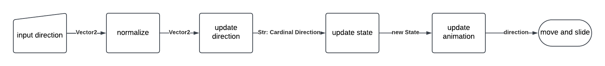
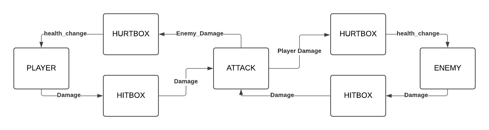
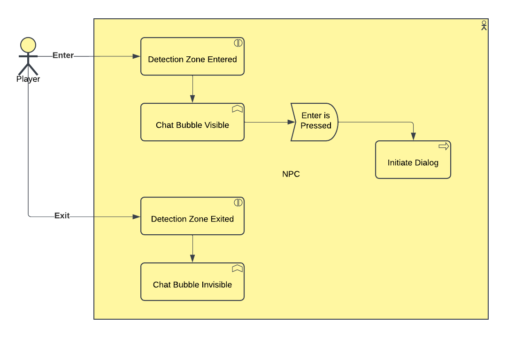
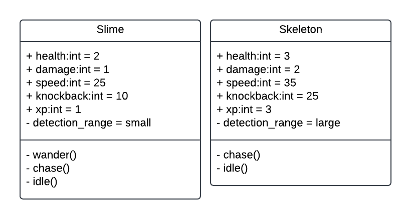

# Minimum Design Specification

## Requirements
* For each _top-level_ requirement, there should be minimally two diagrams that demonstrate implementation details for that requirement.

There are different diagrams that you may use, the first two were covered in class:
* Data Flow Diagram (formal or informal)
* Swimlane or Sequence Diagram
* (Control) Flow Chart
* UML Diagram
* Use-case Models or Diagrams

1. The character shall move.

   Every frame, the direction input from arrow/wasd keys is taken in as a Vector2. If nothing is being pressed it is the zero vector (0, 0). This vector is normalized so that diagonal movement is not faster than horizontal/vertical movement. Next an update_direction functions converts the vector2 into a cardinal direction (up, down, left, right). If the direction was the zero vector, this function returns without changing the current cardinal direction so as to keep the player facing the same direction they where moving when now idle. Next, an update_state function is called that determines if the player has hit the attack button, is pressing the arrow keys, or is idle. Attacking takes precedence over movement if the attack button is pressed. Next, the current state and cardinal direction are used by the update_animation fuction to determine what animation should be playing (attack, walk, idle) and in what direction (up, down, left, right). Lastly, the direction is multiplied by a constant SPEED to get the players velocity. Godot's built in move_and_slide function uses this velocity to move the sprite on the screen. 

   

3. The enemies shall be killable.

   Both player and enemies have hitboxes that deal attacks and hurtboxes that recieve attacks. Attacks are an object that contain the data for the attack such as damage, knockback force and global position where the attack occured. When the player attacks, their hitbox detects if it overlaps with an enemy hurtbox during the attack animation. If so, a new attack object is instantiated and set to the colliding hurtbox. The hurbox upon recieving the attack object can decide how it treats the data within the attack. For all enemies currently implemented, damage is subtracted from the enemies health. If the enemies health is less than or equal to 0, the enemy is killed. The hurtbox also applies a knockback to the enemy based on the force and position recieved in the attack. 
     

4. The play area shall have collision.

5. The play area shall have boundaries.

6. The characters shall have a dialogue mechanic.

7. The characters shall have something meaningful to instruct the player on.

8. The UI shall have a health system.

9. The health system shall accuratley show current health and update accordingly.

10. There shall be an interaction system with certain elements in the enviornment.

11. The interactions shall deliver meaningful information to the player.

   When the player approaches an npc with which they may talk too, a chat bubble will appear above the npc's head indicating the player is able to interact with this npc. Npc's have a detection zone around them that triggers the chat bubble icon's visibility. When a player character enters the zone the visibility is set to true, when the player exits the zone, the visibility is set to false. While within the zone, if the player presses enter, the dialog for that npc will be triggered.  
   

13. The game map shall contain enemies.

14. There shall be enemies that are different enough to require different tactics.

   Slimes: small detection zone, slow speed, low damage, low knockback, low xp, low health. They wander around until player gets in range then chase them. Meant to be an easy, common enemy.  

   Skeleton: Large detection zone, fast speed, high damage, high knockback, high xp, high health. They stand still until player gets in range then chase them. Meant to be an ambush enemy that hides behind trees to suprise player.  
    

16. There shall be a diverse group of characters.

17. The play area shall not be too small to be crammed but not too big to feel empty.

18. he game shall have a UI element for one function (Health).

19. The game shall have a UI element for another function (Controls). 

