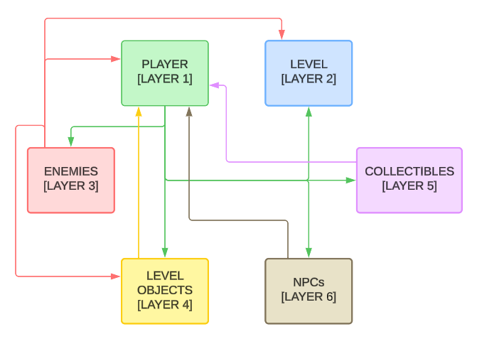
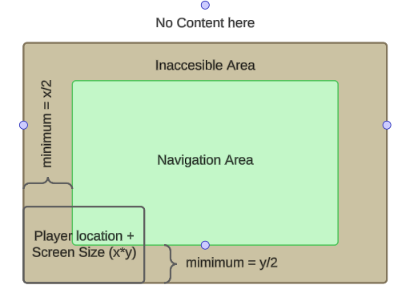
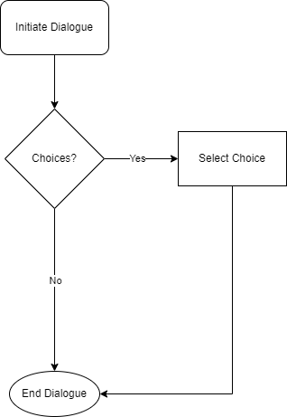
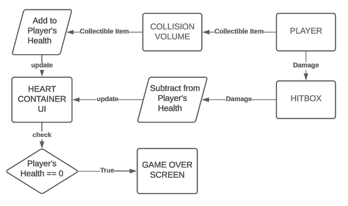
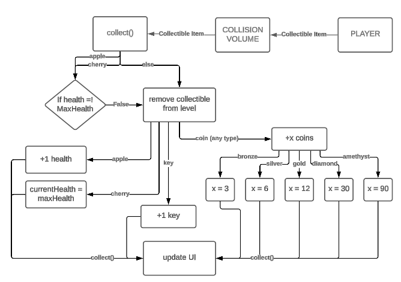

# Minimum Design Specification

## Requirements
* For each _top-level_ requirement, there should be minimally two diagrams that demonstrate implementation details for that requirement.

There are different diagrams that you may use, the first two were covered in class:
* Data Flow Diagram (formal or informal)
* Swimlane or Sequence Diagram
* (Control) Flow Chart
* UML Diagram
* Use-case Models or Diagrams

1. The character shall move.

   Every frame, the direction input from arrow/wasd keys is taken in as a Vector2. If nothing is being pressed it is the zero vector (0, 0). This vector is normalized so that diagonal movement is not faster than horizontal/vertical movement. Next an update_direction functions converts the vector2 into a cardinal direction (up, down, left, right). If the direction was the zero vector, this function returns without changing the current cardinal direction so as to keep the player facing the same direction they where moving when now idle. Next, an update_state function is called that determines if the player has hit the attack button, is pressing the arrow keys, or is idle. Attacking takes precedence over movement if the attack button is pressed. Next, the current state and cardinal direction are used by the update_animation fuction to determine what animation should be playing (attack, walk, idle) and in what direction (up, down, left, right). Lastly, the direction is multiplied by a constant SPEED to get the players velocity. Godot's built in move_and_slide function uses this velocity to move the sprite on the screen. 

   

2. The enemies shall be killable.

   Both player and enemies have hitboxes that deal attacks and hurtboxes that recieve attacks. Attacks are an object that contain the data for the attack such as damage, knockback force and global position where the attack occured. When the player attacks, their hitbox detects if it overlaps with an enemy hurtbox during the attack animation. If so, a new attack object is instantiated and set to the colliding hurtbox. The hurbox upon recieving the attack object can decide how it treats the data within the attack. For all enemies currently implemented, damage is subtracted from the enemies health. If the enemies health is less than or equal to 0, the enemy is killed. The hurtbox also applies a knockback to the enemy based on the force and position recieved in the attack. 
     

3. The play area shall have collision.
   The chart below shows collision between different game elements. The player needs to be able to interact with all of the other elements in the game space, and has arrows pointing to the other game elements to show that. Similarly, the enemies need to be able to interact with the player in order for combat to occur, and they need to be able to interact with the world to move through and around it. The other elements only need to interact with the player directly. The Level contains all of it's own special collision instructions, so no arrows are drawn. 
    

4. The play area shall have boundaries.
   The player has a fixed camera that keeps the player body at the center of the screen at all times. In order to not break immersion, it's important that the player does not see any blank space in the levels where there is no map. To achieve this, there must be a playable area that the player can freely navigate which is enclosed. There will be another area that the player cannot access which functions as a decorative space to hide the edges of the level where the content ends. The inaccessible area must be a minimum of half the height or width of the player camera to accurately hide the blank space. Achieving this will create immersion and a cohesive game environment.
   
    

5. The characters shall have a dialogue mechanic. When you initiate dialogue with a character, a dialogue box will appear at the bottom of the screen. The character will talk with the player, and certain characters may present choices for the player to select from. All dialogues have a point of termination.

   

6. The characters shall have something meaningful to instruct the player on.
   When you reach the hut, Dolvalir may tell you to check around for fruits to heal yourself with.

7. The UI shall have a health system.

8. The health system shall accuratley show current health and update accordingly.
   On begin, the player has a maximum health and a current health, it loads the UI hearts container with the proper number of hearts based on current health, then fills out the rest of the space with empty hearts until the amount of hearts is equal to max hearts. For the UI to update, the player must enter a collision with an element that will change the health, which are healing items or enemies. The enemies have hitboxes, and when the player hits one, health is subtracted. Alternatively, if the player collides with a health item, health will be added if the player is not already at maximum health. After current health is decreased or increased, the script will always call the updateHearts method to update the onscreen UI. If it’s detected that the current health is equal to or less than zero, it will trigger the game over sequence, changing the game scene. When a certain XP has been reached a levelup sequence will trigger. This adds one to maxHealth and updates the UI accordingly.

    

9. There shall be an interaction system with certain elements in the enviornment.
   There are a few different kinds of collectible items. Firstly, the health items apple and cherry are a way for the player to restore health. Both items check if the player is below maximum health before anything else so that the items are not wasted. The apple will add one to current health while the cherry will reset the health back to maximum. After adjusting currentHealth, they will call updateHearts to adjust the hud UI. Next are the coins. There are 5 different kinds of coins on the map; bronze, silver, gold, diamond, and amethyst. They are respectively worth 3, 6, 12, 30, and 90. Just like the health items, when the player walks toward them, the coins’ values will be added to currentCoins, and then updateCoins will be called to update the hud UI. Key works the same way, just adding one at a time every time. Some notable things about the coins, the coin icon on the hud will change based on the amount of coins the player has collected, with amethyst signifying that the player has gotten very rich. Also, slimes and skeletons drop coins when killed. Last on the hud is the XP counter, but this is not a collectible item, this simply serves to track the number of enemies defeated by the player and when to trigger a levelup sequence. 
    

10. The interactions shall deliver meaningful information to the player.

   When the player approaches an npc with which they may talk too, a chat bubble will appear above the npc's head indicating the player is able to interact with this npc. Npc's have a detection zone around them that triggers the chat bubble icon's visibility. When a player character enters the zone the visibility is set to true, when the player exits the zone, the visibility is set to false. While within the zone, if the player presses enter, the dialog for that npc will be triggered.  
   

11. The game map shall contain enemies.

12. There shall be enemies that are different enough to require different tactics.

   Slimes: small detection zone, slow speed, low damage, low knockback, low xp, low health. They wander around until player gets in range then chase them. Meant to be an easy, common enemy.  

   Skeleton: Large detection zone, fast speed, high damage, high knockback, high xp, high health. They stand still until player gets in range then chase them. Meant to be an ambush enemy that hides behind trees to suprise player.  
    

13. There shall be a diverse group of characters.
   - Matthew: The main character that the player is in control of.
   - Guard: A minor non-player character that blocks an entryway in the forest.
   - Cow: A minor non-player character that moos when interacted with.
   - Dolvalir: A major non-player character that interacts with Matthew, either helping or harming him depending on the outcome of dialogue.

14. The play area shall not be too small to be crammed but not too big to feel empty.

15. he game shall have a UI element for one function (Health).

20. The game shall have a UI element for another function (Controls). 

