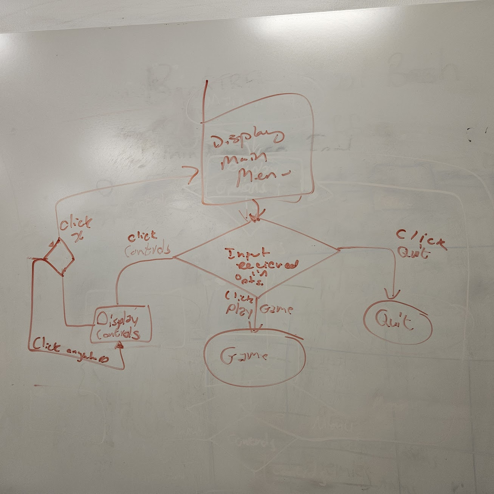

# Meeting Minutes (10/08/2024)

## Administrative
* Time: 1200
* Location: In-Class
* Scribe: Robert Dallessandris

## Agenda
* Weekly Tasks
* UML diagram

## Notes
* Project directory needs organization
* A breaking change was merged into the repo
* NPC's with dialog are now working
* 2 new enemy types added: slime, and skeleton
* On screen ui elements were add such as hearts
* Worked on debugging tent entrance transition
* UML Diagram for Main Menu:
  

## Action Items
* Robert
 * continue working on the player/enemy finite state machine
 * Fix the break in the github repo
* Virginia
 * Work on health system
* Cara
 * Create menu pop up and control screen, maybe make them functional
* Josiah
 * 
 
## UML Diagram

## Signatures
After the notes and action items have been pushed, each person should take a time to review them. If everything is agreeable, push a single commit with your name as a signature. 
* Robert Dallessandris
* Virginia Richards 
* Cara Zozokos
* 
